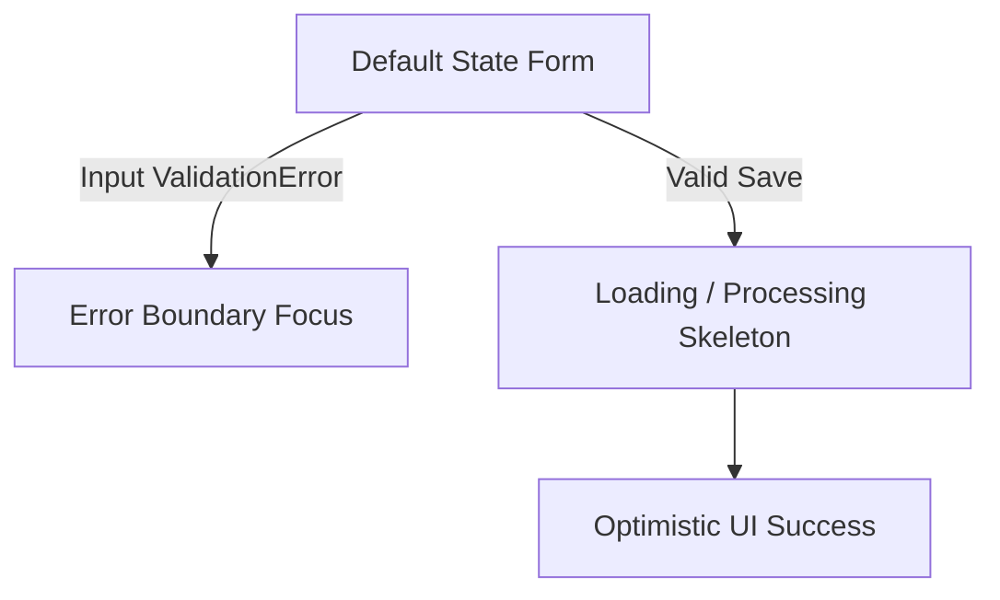

## 1. Design Philosophy & Core Principles

This design system is engineered to provide visual clarity for financial tracking while maintaining a low cognitive load. It supports two primary paradigms:

- **Locality of Style:** Tailored for a hybrid developer-agent workflow. Styles rely entirely on native atomic utilities (Tailwind for Web, Native Flexbox for Mobile) to ensure UI presentation remains co-located with the JSX logic.
- **High Utility & Scannability:** Financial data requires immediate comprehension. The layout uses high-contrast typography, strict color semantics, and structured spatial grids to highlight action items (e.g., High-Priority expenses, over-budget warnings).

---

## 2. Color Palette & Semantic Tokens

To ensure cross-platform consistency and premium visual cohesion, color values are mapped to explicit semantic roles. This system utilizes a custom, tailored **"Mint-Slate"** gray scale infused with subtle green/teal undertones to avoid standard unskinned utility biases and present a premium, trustworthy banking atmosphere. Do not use raw hex codes outside this token definition.

### 2.1 Brand & Neutral Colors (Mint-Slate Palette)

| Token Name       | Hex Code  | Purpose / Application                                   |
| ---------------- | --------- | ------------------------------------------------------- |
| `mint-slate-900` | `#0e1717` | Primary Typography, Web Deep Dark Text                  |
| `emerald-600`    | `#059669` | Primary Brand Color, Financial Stability, Positive Flow |
| `emerald-700`    | `#047857` | Hover states, active pressed states                     |
| `mint-slate-100` | `#f0f4f4` | Primary App Background (Web and Mobile Canvas)          |
| `white`          | `#ffffff` | Card backgrounds, Form inputs, Elevated surfaces        |
| `mint-slate-400` | `#8fa3a3` | Borders, Muted typography, Secondary details            |

### 2.2 Financial Status & Priority Semantics

To eliminate cognitive friction between status tokens and urgency highlights, definitive states use clear background fills while priority attributes rely on distinctive hues paired with explicit iconography.

| Token/State           | Hex Code  | Tailwind Class    | React Native Style Object        | Icon Companion  |
| --------------------- | --------- | ----------------- | -------------------------------- | --------------- |
| **Confirmed Expense** | `#e11d48` | `bg-rose-600`     | `{ backgroundColor: '#e11d48' }` | None            |
| **Planned Budget**    | `#d97706` | `bg-amber-600`    | `{ backgroundColor: '#d97706' }` | None            |
| **High Priority**     | `#ea580c` | `text-orange-600` | `{ color: '#ea580c' }`           | `AlertTriangle` |
| **Medium Priority**   | `#2563eb` | `text-blue-600`   | `{ color: '#2563eb' }`           | `Circle`        |
| **Low Priority**      | `#475569` | `text-slate-600`  | `{ color: '#475569' }`           | `ArrowDown`     |

> 💡 **Rule for Rooms:** The `rooms.color_code` string field saved in the database maps directly to Tailwind/CSS hex codes (e.g., `#3b82f6` for blue, `#a855f7` for purple) to visually tag elements linked to that specific room across both applications.

---

## 3. Typography Hierarchy

Platform rendering boundaries dictate separate typography targets.

### 3.1 Web (Next.js + Tailwind)

Using standard system sans-serif stacks optimized for high-density tables:

- **Page Titles (H1):** `text-3xl font-bold tracking-tight text-mint-slate-900`
- **Section Headers (H2):** `text-xl font-semibold text-mint-slate-900`
- **Table Metrics / Data:** `text-sm font-mono text-slate-800` (Monospace ensures numbers and currency stay aligned row-by-row).
- **Muted Body:** `text-xs text-mint-slate-400`

### 3.2 Mobile (Expo / React Native)

Using native layout components with explicit scale constraints:

- **Header:** `fontSize: 24, fontWeight: '700', color: '#0e1717'`
- **Card Title:** `fontSize: 16, fontWeight: '600', color: '#0e1717'`
- **Quick Input Metric:** `fontSize: 18, fontFamily: 'Platform-Mono' (or system monospace)`
- **Helper:** `fontSize: 12, color: '#8fa3a3'`

---

## 4. UI Layout & Cross-Platform Architecture

### 4.1 Web Application (`apps/web`) - Analytical Focus

The desktop experience is configured as a wide single-pane engine optimized to visualize long-term forecasts.

- **The Financial Calendar Layout:** A 12-month horizontal scrolling array or strict multi-column grid displaying stacked compound values per month:

$$\text{Total Outflow} = \text{Financing Installment} + \text{Confirmed Installments} + \text{Planned Budgets}$$

- **Financing Panel Area Chart:** Positioned immediately above the amortization matrix table. This mini area chart visualizes the 360-month macro evolution:

  - **X-Axis:** Months ($1 \rightarrow 360$).
  - **Y-Axis:** Currency value ($R\$$).
  - **Visual Layer:** An stacked or overlapping area chart where the **Amortization/Principal** layer grows or remains steady (depending on SAC/PRICE) while the **Interest** layer visibly shrinks down to zero over time, offering an instant macro-view of equity building.

- **The Amortization Data Matrix:** Custom components rendering the 360-month table must implement fixed-header structures (`sticky top-0`) with numerical columns aligned `text-right` using tabular-num monospace spacing. Override inputs (`first_parcel_override` and `last_parcel_override`) must float as sticky input fields right beside the calculated boundaries.

### 4.2 Mobile Application (`apps/mobile`) - Operational Focus

The mobile UI prioritizes thumb-driven layouts, quick forms, and physical room measurements.

- **The "+" Quick Action Canvas:** A bottom sheet or specialized route configured for ultra-fast, single-handed input while out shopping. Big button toggles map status configuration (`Budget` vs `Expense`) and payment structures (`Upfront` vs `Installments`).
- **Dual-Input Installment Engine:** Long-term architectural or renovation financing structures are treated natively. The interface displays two highly visible, co-equal inputs:
  1. A continuous thumb-slider mapping structural ranges from **1 to 24 months**.
  2. A co-located text field for direct key entry allowing instant overrides up to **360 months** for major long-term contracts.
- A prominent typography bubble above the canvas dynamically reflects the active count (e.g., `10x installments` or `36x structural loan`).
- A secondary helper text instantly reflects the live math: **"$\text{Total Amount} \div \text{Months} = \text{Amount/month}$"** (e.g., "$R\$\,3,000 \div 10 = R\$\,300\text{/month}$") to provide instant user feedback before saving.

---

## 5. UI Component States & Interaction Specs



```

### 5.1 Inputs & Fields

- **Focus State:** Form elements must present a 2px boundary highlight utilizing the brand accent (`ring-2 ring-emerald-600` on web).
- **Validation Errors:** If Zod parsing blocks an engine submission (e.g., negative room area), the field triggers an immediate transition to `border-orange-500` accompanied by high-visibility text detailing the constraint validation.

### 5.2 Transition to Confirmation (Budget ➔ Expense Toggle)

- When a user flips the status toggle of a budget in Journey B, the card container executes a rapid color transition from warning semantic states (`amber-600`) to definitive spending confirmations (`rose-600`), recalculating charts via optimistic state updates instantly.

---

## 6. Guardrails for UI Generation (AI-AX Instructions)

- **Rule 1 (Web Stack):** Do not inject raw styling scripts or component-heavy dependencies. Stick strictly to primitive layout containers styled with tailwind atomic utilities. Use standard feather-weight charting primitives (like unstyled `recharts` elements) for the financing chart.
- **Rule 2 (Mobile Stack):** Never import `react-dom` elements or tailwind web classes. Build components leveraging pure React Native layouts (`<View>`, `<Text>`, `<TouchableOpacity>`) and native slider primitives.
- **Rule 3 (Icons):** Use `lucide-react` for Web and `@expo/vector-icons` (Lucide icons variant) for Mobile to preserve iconography consistency across the mono-repo.
```
